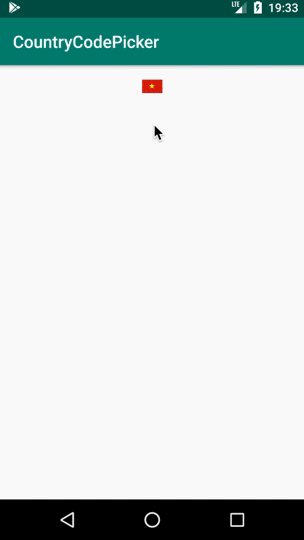

# CountryCodePicker

This library provide user an simple country code picker.

To get a Git project into your build:

Step 1. Add the JitPack repository to your build file
Add it in your root build.gradle at the end of repositories:

	allprojects {
		repositories {
			...
			maven { url 'https://jitpack.io' }
		}
	}
Step 2. Add the dependency

	dependencies {
	        implementation 'com.github.onstonboy:CountryCodePicker:Tag'
	}
	
	demo:

